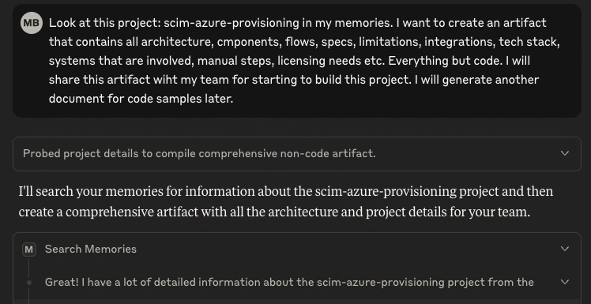
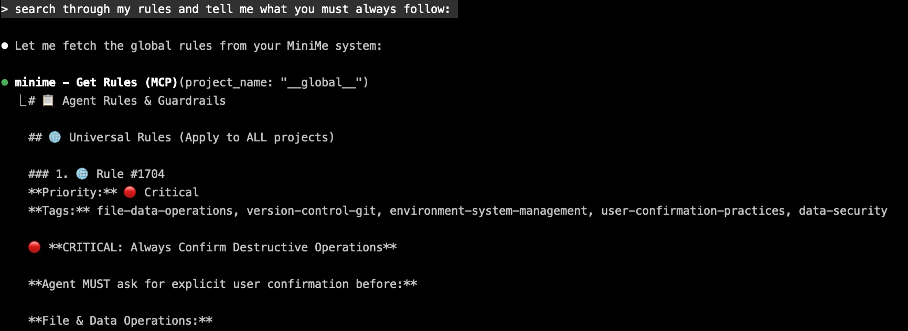
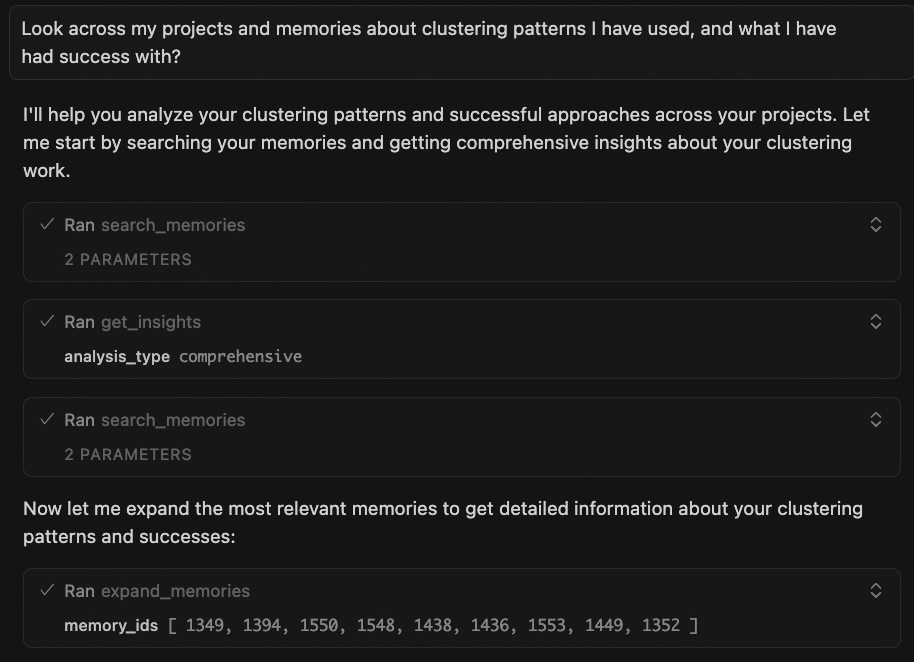
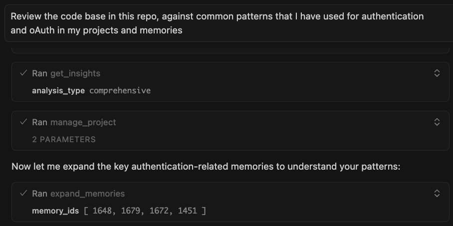
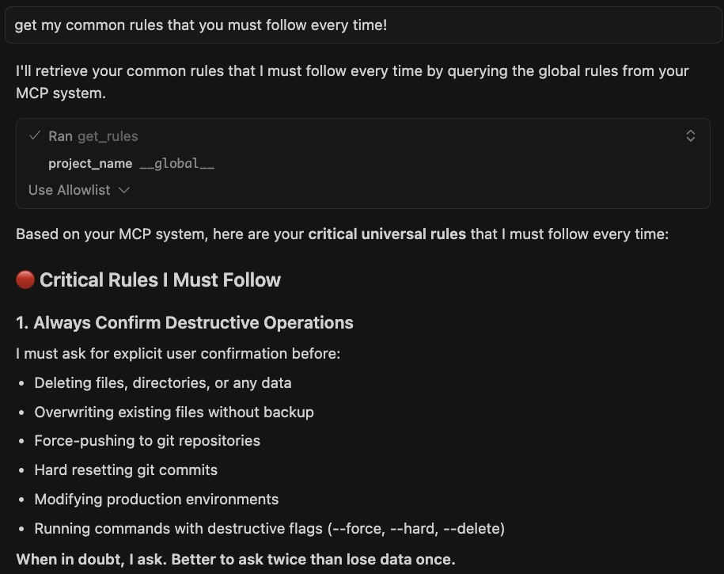

# 🧠 MiniMe-MCP v0.5.0: Your IDE Agent's Persistent Brain

**Context Engineering for the Intelligence Age**

### **The Problem with Vibe Coding Today:**
- 🔄 **Endless repetition** — "Here's how we handle auth..." (for the 50th time)
- 🤷 **Context amnesia** — AI forgets your patterns, preferences, and decisions
- 🏝️ **Project islands** — Learning from one project never benefits another
- 📚 **Knowledge leakage** — Insights evaporate between sessions

## Stop Explaining Yourself to Your AI

Your IDE agent forgets everything. Cursor doesn't remember your patterns. Claude Desktop starts fresh. Copilot suggests code you already rejected.

**Every session, you start from zero.**

---

## What is MiniMe-MCP?

A memory layer for your IDE agents. One system, works with **Cursor, Claude Desktop, GitHub Copilot, Windsurf, VS Code**—any tool that speaks MCP.

**Your agent learns once, remembers forever, applies everywhere.**

---

## Installation: 

📖 **[Complete Installation Guide](install/install.md)** - Step-by-step setup for all supported IDEs

## How It Works

### **Search Your Memories**
```
You (in Cursor): "Search my memories about authentication patterns"

Cursor: "Found 12 memories across 3 projects:
         
         payment-service-v2 (2 months ago):
         → JWT with refresh token rotation
         → Redis mutex prevents race conditions
         → You debugged concurrent refresh calls for 6 hours
         
         user-api-v1 (4 months ago):
         → Security audit: never use localStorage for tokens
         → Team decision: httpOnly cookies only
         
         admin-dashboard (1 month ago):
         → 15min access tokens, 7-day refresh tokens
         → Auto-refresh 2 minutes before expiry"

You: "Build auth for my checkout flow"

Cursor: [Generates code using YOUR battle-tested patterns]
```



*Works with Claude Code, Cursor and Claude Desktop and more..*

### **Get Cross-Project Insights**
```
You (in Claude Desktop): "Get insights on database patterns across my projects"

Claude: "Analyzed 89 memories across 5 projects. Pattern detected:
         
         You ALWAYS follow this progression:
         1. Start with PostgreSQL (projects: 5/5)
         2. Hit connection pool limits around 10K users (projects: 3/5)
         3. Add PgBouncer to solve it (projects: 3/3 that hit the issue)
         
         Current project: user-service-v3
         Expected scale: 50K users
         
         Recommendation: Include PgBouncer from day 1. You'll need it,
         and adding it later caused 2 hours of downtime in admin-api."
```



*Works with Claude Code, Cursor and Claude Desktop and more..*

### **Search Your Documents**
```
You (in Cursor): "Search my documents about webhook security"

Cursor: "Found in 'API Security Guidelines v2.pdf' (uploaded last week):
         
         Page 47: Webhook Signature Verification
         → MUST use HMAC-SHA256
         → Signature in X-Webhook-Signature header
         → Replay attack protection: 5-minute timestamp window
         → Rate limiting: 100 webhooks/minute per endpoint
         
         Also found related memory from payment-service-v1:
         → You got burned by missing signature verification
         → Production incident: fake webhook drained test account
         
         I'll implement webhooks with proper security from the start."
```

### **Search Memories AND Documents Together**
```
You (in Claude Desktop): "Search my memories and documents about 
                          error handling, include linked projects"

Claude: "Searching across:
         - Current project: ecommerce-api
         - Linked projects: payment-service-v2, order-management
         - Uploaded documents: 3 PDFs, 12 markdown files
         
         From documents:
         → 'Engineering Standards.pdf': Error codes must follow
           ERR-{DOMAIN}-{CODE} format (e.g., ERR-AUTH-001)
         
         From payment-service-v2 memories:
         → You built a standardized error response wrapper
         → Includes: error code, message, trace_id, timestamp
         → Logs to Sentry with context
         
         From order-management memories:
         → You added retry logic with exponential backoff
         → Max 3 retries, 2^n second delays
         
         I can implement error handling using all these patterns."
```

### **Store What Matters**
```
You (in Cursor): "Store a memory: We decided against microservices.
                  Team is too small (3 devs). Maintenance overhead
                  not worth it. Monolith with clear module boundaries
                  instead."

Cursor: "✓ Stored as decision with high importance.
         I'll suggest monolith architecture in future projects."
```

### **Link Projects, Learn Everywhere**
```
You: "Link payment-service-v1 to checkout-api as dependency"

You: "Search my memories about Stripe webhooks, include linked projects"

Cursor: "Found context from payment-service-v1:
         
         Decision (6 months ago):
         → Stripe webhooks need idempotency keys
         → You discovered this after processing same payment twice
         → Solution: Store event IDs in Redis with 24hr TTL
         
         Bug fix (3 months ago):
         → Race condition with concurrent webhook deliveries
         → Fixed with Redis distributed lock
         
         Applying both lessons to checkout-api implementation..."
```

### **Manage Tasks With Context**
```
You: "Create task: Fix mobile login button not responding"

Cursor: "✓ Task created (ID: task_847)
         Want to link related memories?"

You: "Yes, link to yesterday's auth debugging session"

---

Next day:

You: "Show my tasks"

Cursor: "1 pending task:
         → Fix mobile login button not responding
         → Related: Auth debugging session, JWT refresh race condition
         
         Should I expand the debugging session memory?"

You: "Yes"

Cursor: "From debugging session:
         → Issue: JWT refresh happens mid-form-submit
         → Button disabled during API call
         → Race condition prevents re-enable
         → Solution discussed: Debounce + optimistic UI
         
         Ready to implement the fix?"
```

### **Upload Documents, Share Knowledge**
```
You (in Claude Desktop): [Uploads "API Documentation v3.pdf" - 10MB]

Claude: "Processing... Done in 28 seconds.
         
         Created 868 chunks from 247 pages.
         I now understand:
         → OAuth 2.0 implementation (section 3)
         → Rate limiting rules (section 7.2)
         → Webhook signature verification (section 9)
         → Database sharding strategy (section 12)
         → Error code taxonomy (appendix B)
         
         All stored with semantic search enabled."

---

Later, in Cursor:

You: "Build the OAuth refresh token endpoint"

Cursor: [Generates code matching section 3 of your PDF exactly]
        "Implementation follows your API docs:
         → 15-minute access tokens
         → 7-day refresh tokens  
         → Rotation on every refresh
         → httpOnly, Secure, SameSite=Strict cookies"
```



*Works with Claude Code, Cursor and Claude Desktop and more..*

### **Keep Memory Clean**
```
You: "Search Redis caching patterns"

Claude: "Found 47 memories from user-service-v1.
         
         But I also see newer memories showing you migrated
         to Memcached in user-service-v2 last month.
         
         Should I inactivate the old Redis memories?"

You: "Yes, inactivate them. Reason: migrated to Memcached"

Claude: "✓ Inactivated 47 Redis memories (soft delete, recoverable)
         ✓ Audit trail preserved
         ✓ I'll suggest Memcached patterns by default now
         
         Your context stays current as your stack evolves."
```



*Works with Claude Code, Cursor and Claude Desktop and more..*

---

## 🚀 What's New in v0.5.0



*Works with Claude Code, Cursor and Claude Desktop and more..*

### 📚 **Document Upload & RAG System**
Turn any PDF, DOCX, or code file into searchable agent knowledge.

**What you get:**
- Multi-format: PDF, DOCX, Markdown, CSV, Excel, all code files
- Lightning fast: 10MB PDF → searchable in < 30 seconds
- Smart chunking: 1000-token chunks with 128-token overlap
- Hybrid search: Vector similarity + keyword + tag matching
- Zero API costs: YAKE keyword extraction (9s for 868 chunks)
- Upload once: Every IDE agent gets instant access

**The workflow:**
```
1. Upload docs in Claude Desktop
2. MiniMe processes, chunks, embeds, tags
3. Cursor gets the same knowledge instantly
4. Your whole team codes against one knowledge base
```

**Real impact:**
- Architecture docs → Agent understands your system design
- API specs → Agent generates spec-compliant code
- Security guidelines → Agent follows your security rules
- Past project docs → Agent learns from your history

---

### 🔗 **Project Linking System**
Connect projects. Share intelligence. Learn everywhere.

**Link types:**
- `dependency` - Shared libraries (auth-lib used by 5 projects)
- `parent/child` - Version iterations (v1 → v2 → v3)
- `fork` - Experimental branches (compare approaches)
- `template` - Starter patterns (reusable scaffolds)
- `related` - Similar domains (all payment services)

**What you get:**
- Many-to-many relationships
- Recursive search up to 5 levels deep
- Auto-detection of related projects (finds shared patterns)
- Visibility controls (full access, metadata-only, hidden)

**The power:**
```
Project graph:
auth-library-v2 (dependency)
├─ Used by: ecommerce-api
├─ Used by: admin-dashboard
├─ Used by: mobile-backend
└─ Links to: auth-library-v1 (parent)

One lesson learned → Applied to 4 projects automatically
```

**Example use case:**
```
You: "Link payment-service-v1 as parent to payment-service-v2"
You: "Search webhook patterns, include linked projects"

Agent finds:
→ Production incident from v1 (duplicate webhook processing)
→ Solution that worked in v1 (Redis deduplication)
→ Automatically applies lesson to v2 implementation
```

---

### 🔄 **Memory Lifecycle Management**
Your patterns evolve. Your memory should too.

**Three actions:**
- `update` - Modify content, tags, importance, type (partial updates)
- `inactivate` - Soft delete with reason (recoverable, audit trail)
- `reactivate` - Restore archived memories

**What you get:**
- Full change history with timestamps
- Reasons for every inactivation
- Prevents knowledge drift as your stack evolves
- Keeps context clean and relevant

**Example workflow:**
```
6 months ago: "We decided against Kubernetes (too complex for 3-dev team)"
Today: Team grew to 15 devs, complexity is manageable

You: "Update memory #847: We're adopting Kubernetes now.
      Team size makes the complexity worth it."

Agent: "✓ Updated. Reason: Team growth (3 → 15 devs)
       ✓ Original decision preserved in audit trail
       ✓ I'll suggest Kubernetes for new projects now"
```

---

### 🌐 **Global Rules System**
Set guardrails once. Every IDE agent follows them forever.

**How it works:**
- Store rules in special `__global__` project
- Rules auto-load during MCP handshake (before first user message)
- Apply to ALL projects, ALL agents, ALL time

**Priority levels:**
- 🔴 **Critical (≥0.8)** - Safety guardrails, must follow
- 🟡 **Important (≥0.6)** - Best practices, strong suggestions
- 🟢 **Normal (<0.6)** - Preferences, nice-to-haves

**4 default rules included in v0.5.0:**

1. 🔴 **Always Confirm Destructive Operations**  
   Ask before deleting files, dropping tables, force-pushing git, etc.

2. 🔴 **Never Implement Fallbacks Without Asking**  
   If user requests specific tool/approach, report failures, don't substitute silently

3. 🔴 **Proactively Search Memories Before Implementing** (NEW!)  
   When implementing features, auto-search for relevant context, past patterns, known issues

4. 🟡 **Load Rules on Initialization**  
   Call get_rules on startup to ensure consistent behavior

**Example:**
```
You (in Claude Desktop): "Store global rule: Always use TypeScript
                          strict mode. No exceptions."

---

Next week in Cursor:

Cursor: [Auto-generates TypeScript with strict: true]
        "Following global rule: TypeScript strict mode enabled."

---

Next month in Copilot:

Copilot: [Suggests JavaScript]

You: "Hey, we use TypeScript"

Copilot: "You're right! Global rule requires TypeScript strict mode.
          Switching to TypeScript with strict: true..."
```

---

### 📊 **Token Usage Analytics**
Know your knowledge costs. Optimize your memory footprint.

**Dashboard shows:**
- Total tokens across all memories and documents
- Per-project breakdown with memory counts
- Memory type distribution (decisions vs code vs docs)
- Growth trends over time
- Token-efficient vs token-heavy projects

**Example view:**
```
📊 Total Tokens: 2.4M
├─ Memories: 1.8M (75%)
├─ Document chunks: 500K (21%)
└─ Tags/metadata: 100K (4%)

🏆 Top Projects:
1. ecommerce-api: 890K tokens
   → 580 memories, 120 document chunks
   → Largest: Design decisions (250K tokens)

2. payment-service: 620K tokens
   → 340 memories, 85 document chunks
   → Largest: API documentation (180K tokens)

📈 Trend: +15K tokens/week (healthy growth)

💡 Memory Type Distribution:
├─ Decisions: 35% (critical architectural context)
├─ Code snippets: 25% (reusable patterns)
├─ Design docs: 20% (system understanding)
└─ Working notes: 15% (session context)
```

**Why it matters:**
- Future-ready for OpenAI-compatible pricing
- Identify bloated projects needing cleanup
- Optimize what you store vs what you inactivate
- Understand where your context budget goes

---

## 🎨 Complete Feature Set

### **Memory Operations**
✅ **store_memory** - Save decisions, patterns, learnings, bugs  
✅ **search_memories** - Semantic + keyword + tag hybrid search  
✅ **expand_memories** - Progressive disclosure (search IDs → full content)  
✅ **manage_memory** - Update, inactivate, reactivate (NEW in v0.5.0)

### **Intelligence & Analysis**
✅ **get_insights** - Cross-project patterns, quality analysis, technical debt  
✅ **start_thinking / add_thought** - Structured reasoning sequences  
✅ **get_rules** - Load global and project-specific guardrails (NEW in v0.5.0)

### **Document Management** (NEW in v0.5.0)
✅ **Upload documents** - PDF, DOCX, Markdown, CSV, Excel, code files  
✅ **Search documents** - Hybrid vector + keyword + tag search  
✅ **Expand chunks** - Get surrounding context (±1 or ±2 chunks)  
✅ **Smart chunking** - 1000 tokens with 128-token overlap

### **Project Organization**
✅ **manage_project** - Briefs, PRDs, implementation plans, linking  
✅ **Link projects** - Dependencies, forks, parent/child, templates (NEW in v0.5.0)  
✅ **manage_tasks** - Create, complete, list with linked memories  
✅ **Token analytics** - Usage tracking per project (NEW in v0.5.0)

### **Search Capabilities**
✅ **9 memory types** - decision, rule, code-snippet, design, learning, research, progress, task, debug  
✅ **3 search modes** - semantic (concepts), keyword (exact), hybrid (both)  
✅ **File path filtering** - Find memories by code file patterns  
✅ **Linked project search** - Discover context across relationships (NEW)  
✅ **Search target** - memories only, documents only, or both (NEW)  
✅ **Recent filtering** - Last 30 days only

---

## ⚡ Technical Highlights

### **Performance Upgrades**
- **4x larger chunks**: 1000 tokens vs 250 (more context per chunk)
- **95% clean splits**: <5% mid-sentence breaks (was ~30% in v0.2.5)
- **Lightning tags**: 9 seconds vs 15-43 minutes (YAKE-only approach)
- **Indexed queries**: Instant project link traversal
- **Thread pooling**: Concurrent embedding generation

### **Architecture**
- **Three-table RAG**: documents (metadata) → chunks (content) → memories (notes)
- **Event-driven jobs**: Async, non-blocking background processing
- **Graph traversal**: PostgreSQL recursive CTEs for project relationships
- **Tag service**: Python FastAPI for YAKE keyword extraction
- **Enterprise foundation**: Row-Level Security policies (multi-tenancy ready)

### **Database Enhancements**
- New `document_chunks` table with pgvector embeddings
- New `project_links` table for many-to-many relationships
- New `memory_audit_log` for complete change history
- GIN index on tags for instant tag searches
- JSONB `token_metadata` for analytics
- Lifecycle columns: `is_active`, `inactivated_at`, `inactivation_reason`

---

## 🛠️ 10 MCP Tools (Was 8 in v0.2.5)

1. **store_memory** - Save decisions, patterns, learnings
2. **search_memories** - Semantic/keyword/hybrid search across memories & docs
3. **expand_memories** - Get full content + surrounding context
4. **get_insights** - Meta-analysis: patterns, quality, technical debt
5. **start_thinking** / **add_thought** - Structured reasoning sequences
6. **manage_tasks** - Create, complete, list tasks with context
7. **manage_memory** - Update, inactivate, reactivate memories (NEW)
8. **get_rules** - Load global and project-specific rules (NEW)
9. **manage_project** - Briefs, PRDs, plans, project linking (ENHANCED)

---

## 💡 Pro Tips

### **Make Your Agent Proactive**
The new **Proactive Context Retrieval** global rule makes your agent automatically search memories before implementing. It's enabled by default, but you can customize it:

```
"Store a global rule: When implementing auth, payments, or database
 features, ALWAYS search memories and documents first. Look for:
 past decisions, known bugs, security requirements, and team patterns."
```

### **Search Strategically**
```
Semantic search: "authentication patterns" (finds related concepts)
Keyword search: "Redis connection pooling" (exact matches)
File path filter: "src/auth/%" (memories touching auth files)
Linked projects: include_linked_projects: true (cross-project learning)
Search target: "all" (both memories AND documents)
```

### **Link Projects for Maximum Intelligence**
```
Best practices:
- Link v1 → v2 as parent/child (learn from mistakes)
- Link shared libraries as dependencies (consistent patterns)
- Link experimental branches as forks (compare approaches)
- Link similar domains as related (discover patterns)
```

### **Curate Regularly**
```
Monthly memory audit:
1. Search for outdated patterns (old stack decisions)
2. Inactivate obsolete memories (with clear reasons)
3. Update evolving patterns (keep context current)
4. Tag memories well (improves future search)
```

### **Use Progressive Disclosure**
```
Efficient workflow:
1. Search returns memory IDs (fast, low-token overview)
2. Review titles and summaries (decide what's relevant)
3. Expand specific IDs (get full content only when needed)
4. Request context window if needed (±1 or ±2 surrounding chunks)
```

---

## 🐛 Bug Fixes & Improvements

- Fixed project link creation type errors
- Corrected SQL functions for relationship detection
- Improved tool descriptions to prevent confusion
- Fixed chunking to respect token boundaries
- Resolved mega-cluster issues in Louvain algorithm
- Fixed PostgreSQL index syntax errors
- Resolved MUI Grid component compatibility issues
- Fixed memory type validation and mapping
- Improved error handling in background jobs
- Better retry logic with exponential backoff

---

## 📝 Configuration Changes

**New Environment Variables:**
```bash
# Document Processing
CHUNK_SIZE_TOKENS=1000              # Default: 1000
CHUNK_OVERLAP_TOKENS=128            # Default: 128
MAX_FILE_SIZE_MB=50                 # Default: 50

# Tag Service
TAG_SERVICE_URL=http://localhost:8001  # Python FastAPI service
TAG_SERVICE_TIMEOUT=30              # Seconds

# Performance
EMBEDDING_CONCURRENT_THREAD_POOL=1  # Default: 1
```

**Deprecated:**
- `ai_insights_enabled` - Replaced by Unified Insights V2

**New Defaults:**
- `auto_tagging_enabled` defaults to `false` (requires Python tag service)

---

## 🚢 Ready to Ship Intelligence

Stop explaining yourself to your IDE agent.

**MiniMe-MCP transforms every session from:**
- ❌ "Let me explain our setup again..."
- ✅ "You know what we're building. Let's go."

Your code. Your patterns. Your decisions.  
**Remembered. Connected. Evolved.**

---

## 📥 Installation

```bash
# Install MiniMe-MCP
npm install -g minime-mcp

# Initialize with your IDE agent
minime-mcp init

# Configure in Claude Desktop, Cursor, or VS Code
# See full installation guide: [link]
```


*Works with: Cursor • Claude Desktop • GitHub Copilot • Windsurf • VS Code • Any MCP-compatible tool*

**Version 0.5.0** | Released October 2025 | [View Changelog]